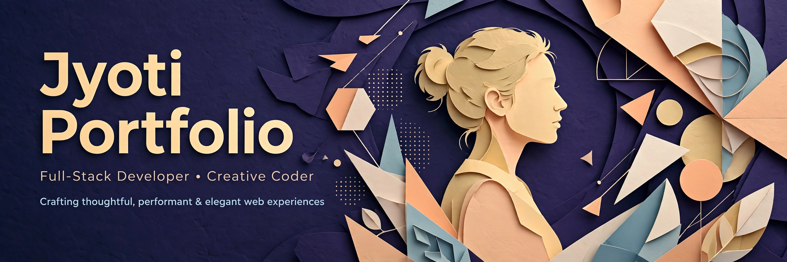

# Jyoti Portfolio

> ## Status: 🟢 Completed
>
> <progress value="85" max="100"></progress>
> **Progress: 85%** — Polished portfolio site; production build verified.

<p align="center">
  
</p>


## What it is

A personal portfolio website with a playful paper-craft visual style — layered SVG illustrations, tilt-on-hover cards, bouncy animated notes, and a light/dark theme toggle. Built with React 19, Tailwind CSS 4, and Bootstrap components, it presents the owner's work across illustrated "pages" with a custom SVG art set.

## What works (verified)

- ✅ Production build — `npm install` + `vite build` completed with exit 0 (verified on this machine)
- ✅ Light/dark theme toggle — `ThemeToggle` in `App.jsx`
- ✅ 3D tilt cards reacting to the pointer — `TiltCard` component
- ✅ Bouncy animated note elements — `BouncyNote` component
- ✅ Layered SVG page illustrations (page1–page6 art sets) — `src/assets/pages/`
- ✅ ESLint config for code quality — `eslint.config.js`

## Tech stack

| Layer | Tech |
|---|---|
| Framework | React 19 |
| Build | Vite 8 |
| Styling | Tailwind CSS 4, Bootstrap 5, react-bootstrap |
| Lint | ESLint 10 |

## How to run

```bash
npm install
npm run dev      # dev server with hot reload
npm run build    # production build → dist/
npm run preview  # preview the production build
npm run lint     # eslint check
```

> Verified: `npm install` (190 packages) and `npm run build` both succeed.

## Screenshots

No screenshots ship with the repo. The banner above is the visual; run `npm run dev` to see the site.

## What you can add more

- [ ] Real content pages — page2–page6 art folders are mostly empty (`.gitkeep` only)
- [ ] Projects section with case studies — the portfolio's core content
- [ ] Contact form — currently no way to reach out
- [ ] Resume download — a portfolio staple
- [ ] SEO meta tags + Open Graph image
- [ ] Reduced-motion support — the tilt/bounce animations ignore `prefers-reduced-motion`

## Project structure

```
Jyoti_Portfolio/
├── src/
│   ├── App.jsx            # Theme toggle, tilt cards, page composition
│   ├── App.css
│   ├── main.jsx
│   └── assets/
│       ├── hero.png
│       └── pages/         # SVG illustration sets (page1–page6)
├── public/
├── index.html
├── vite.config.js
├── eslint.config.js
└── package.json
```

---
*README written after code audit on 2026-10-08.*
